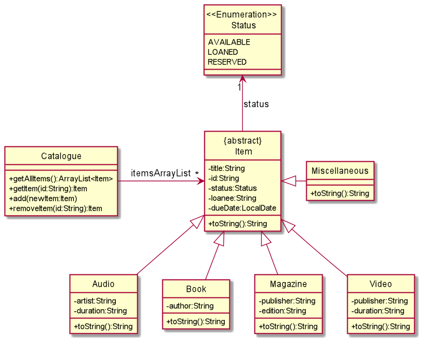
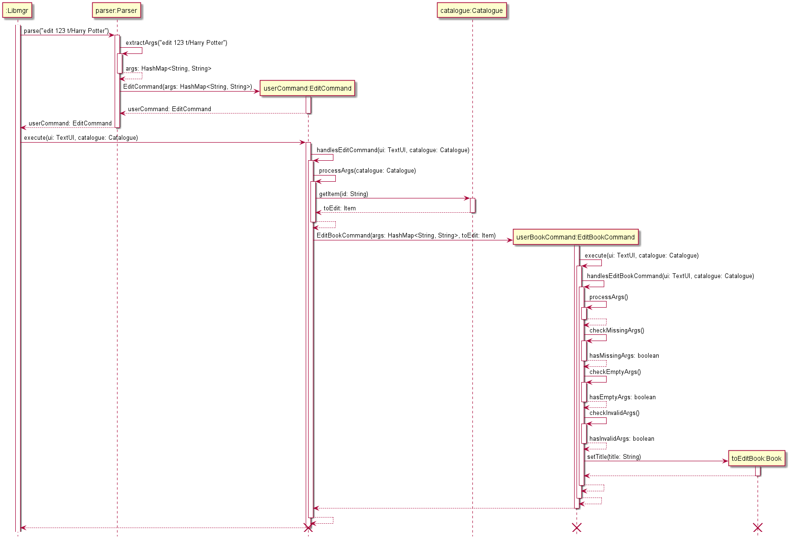

# Developer Guide

## Acknowledgements

{list here sources of all reused/adapted ideas, code, documentation, and third-party libraries -- include links to the original source as well}

## Design & implementation

This section provides an overview of the design architecture and implementation of Libmgr. Each sub-section provides a detailed explanation of the design of each component

### Architecture Diagram

### Entrypoint of Libmgr

---

### Data Package

The data component consists of a `data` package which holds classes that aim to allow the categorisation of items into different types.

### Commands Package

The commands component consists of a 'commands' package which holds a main Parser class to execute all the commands, as well as 
individual class files, each corresponding to a specific command, that inherit from an abstract command class.

#### Edit Command 

The Edit Command class handles the functionality to change a specific detail of an item in the catalogue.

## Product scope
### Target user profile

Library staff who prefer keyboard inputs and require a text based application to quickly track and update the statuses of items within their catalogue

### Value proposition

This product aims to streamline the process of managing the book catalogues within their library. It will allow library staff to quickly track their books, such as finding out their location and status. Designed for fast typists, it also allows staff to track their inventory faster and more efficiently.

## User Stories

|Version| As a ... | I want to ... | So that I can ...|
|--------|----------|---------------|------------------|
|v1.0|librarian|add items to the catalogue|keep the full catalogue up to date|
|v1.0|librarian|remove items from the catalogue|keep the full catalogue up to date|
|v1.0|librarian|update the status of an item when it is loaned out|keep the full catalogue up to date|
|v1.0|librarian|update the status of an item when it is returned|keep the full catalogue up to date|
|v1.0|librarian|check the list of items available in the library||
|v1.0|librarian|check the list of items on loan||
|v1.0|librarian|check the list of all items in the library||
|v2.0|librarian|categorise different items into media forms. (E.g. book, magazine, audio, video)|better manage my catalogue
|v2.0|librarian|edit the details of existing items on the catalogue|keep the full catalogue up to date||
|v2.0|librarian|reserve and unreserve an item by updating its status|keep the full catalogue up to date||
|v2.0|librarian|search for specific items by their title or ID|retrieve the details of items I need||
|v2.0|librarian|check the list of items on reservation||
|v2.0|librarian|loan an item for a person specified by their username||
|v2.0|librarian|reserve an item for a person specified by their username||
|v2.0|librarian|view what items are due to be returned today|| 
|v2.0|librarian|view the list of overdue items|inform people to return them|| 

## Non-Functional Requirements

{Give non-functional requirements}

## Glossary

* *glossary item* - Definition

## Instructions for manual testing

{Give instructions on how to do a manual product testing e.g., how to load sample data to be used for testing}
